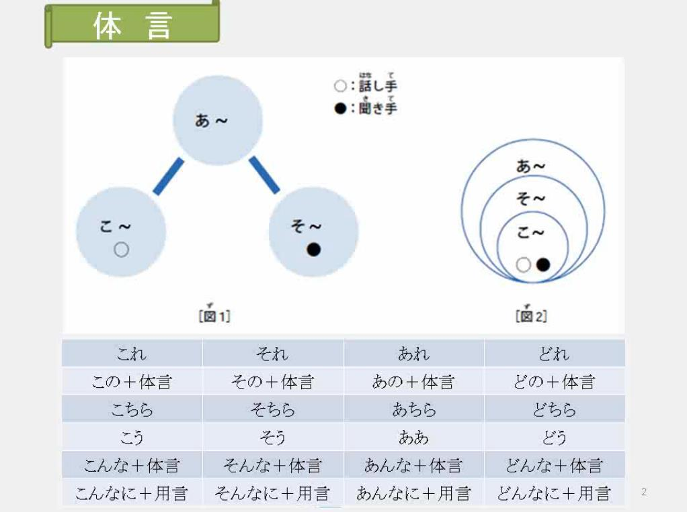

# こ、そ、あ、ど




> これ、それ、あれ、どれ 习惯指物.


> こちら、そちら、あちら、どちら

指代地方

1. 方向 ～边
  こちらへ　どうぞ
  電話はそちらです
  電話はそこです

2. 人
  こちらは　マイク　ミラーさんです

3. ここ、そこ、あそこ、どこ 的礼貌形式
  お国はどちらですか
  ご出身（しゅっしん）はどちらですか

4. こちら、そちら、どちら 双方中的一方，二选一.
  こちらこそ　よろしく

あれ  --  表示那个。
场景：想不起来的词，或者不想话说的那么透。


# 第一单元的句型
```
`Aは　Bです` -- A是B。
`Aは　Bでは　ありません` -- A 不是 B。
`Aは　Bじゃ　ありません` -- A 不是 B。

`Aは　Bですか` -- A是B吗？
肯定回答：
はい、～です
はい、そうです
否定回答：
いいえ,～では,ありません
いいえ、そうでは、ありません
いいえ、ちがいます

Aは　Bですか、Cですか -- A是B呢，还是C呢？
```

>  （场所に）　人/物 が　います/あります

练习：
```
包里面有什么？ 书和笔记本。
かばんのながに何がありますか 。
ほんとノート。
```
简单来说：何`なに/なん`
在`か、が、も` 三个助词，前面读成`なに`

```
冰箱里面有面包吗？ 没有，有牛奶。
冷蔵庫のなかにパンがありますか？
いいえ、ありません、ミルクがあります。
```
-----
```
院子里面一个人也没有。
庭に誰もいません
```
-----
```
我既没有车，也没有房。
私に車がいません、　家もありません
```

> （人/物は） 场所に　います/あります

```
电话不在桌子上面，在桌子下面。
電話は机のうえにありません、机の下にあります。
```
-----
```
小猫在哪儿？ 在门后面呢。
猫はどこですか？猫は門に後ろいます
```
-----
```
小李在公司吗？不，她在图书馆。
李さんは会社にりますか？いいえ、図書館にります
```

# 数字


# 时间


表示几点：～時
```
一時 -- 一点
二時 -- 二点
三時 -- 三点
四時（よんじ） -- 四点 √
七時（しちじ） -- 七点 √
八時 -- 八点
九時(くじ) -- 九点 √
十一時（じゅういちじ） -- 十一点
十二時（じゅうにじ） -- 十二点
```


二十四小时制和十二小时制
```
午後一時 (ごごいちじ)
十三時(じゅうさんじ)

午後七時（ごごしちじ）
十九時（じゅうくじ）
```

# 分钟 & 星期


```
七時三十分（しちじさんじゅぷん）/七時半(しちじはん) -- 七点半
九時半(くじはん) -- 九点半
何時何分（なんじなんぷん） -- 几点几分
```

```
げつようび 
かようび
すいようび
もくようび
きんようび
どようび
にちようび
なんようび
```

# tips

翻译，或者中日语言互换，不需要一个字一个字对应翻译。会出现汉语式的日语。
