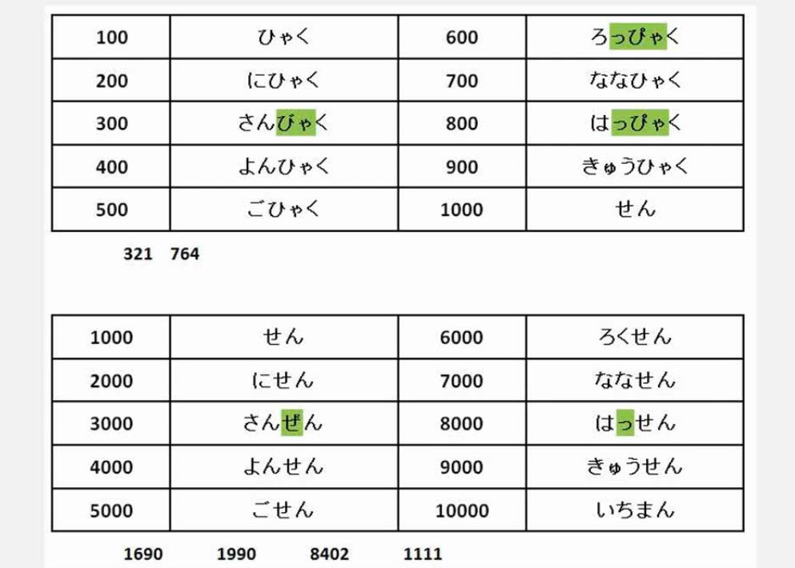

# ここは　デパートです

> ここ そこ あそこ

ここ/そこ/あそこは　～　です/じゃありません/ですか
ここ/そこ/あそこ 是 ～

```
ここは図書室(としょしつ)です -- 这里`是`图书馆
そこは事務所（じむしょ）じゃありません -- 那里`不是`办公室
あそこは食堂（しょくどう）ですか -- 那里`是`食堂`吗`？
```

> 食堂はデパートの　７階です

～は　ここ/そこ/あそこ　です/じゃありません/ですか
（人，物，场所）在（ここ/そこ/あそこ）

```
かばんはここです  -- 包`在`这里
傘はそこじゃありません -- 伞`不在`哪里
マリーさんはあそこですか -- 玛丽`在`哪里`吗`？
```

> こちら、そちら、あちら、どちら

1. 方向  ～边
  可能看不见，但是方向是当前这个方向。
  こちらへ　どうぞ. 这边请。
2. 人
3. ここ、そこ、あそこ、どこ 的礼貌形式  
  个人信息
  お国はどちらですか
  ご出身（しゅっしん）はどちらですか
4. こちら、そちら、どちら 双方的一方，二选一  
  打电话，写信，看比赛
  こちらこそ　よろしく

> も 也

助词

は 的位置换成 も
两个以上 も表示都。

```
李さんは　会社員です
小野さんも　会社員です

李さんは　学生では　ありません
（李さんは）先生でも　ありません
小李不是学生，也不是老师

吉田さんも　森さんも　会社員です。  吉田先生和森先生都是职员。
スミスさんも　キムさんも　日本人では　ありません。 斯密斯先生和金先生都不是日本人。
```

> 选择疑问句

Aは　Bですか、Cですか。
回答直接回答正确答案。

A是B呢，还是C呢？

```
これは　１ですか、７ですか。 这是1还是7呢？
それは　タブレットですか、携帯（けいたい）ですか 。 这个是平板电脑还是手机呢？
そのかばんは　四千元ですか、四千円ですか。 这个包是4000人民币还是4000日元？
```

> [名词]はいくら　ですが

询问价格的时候：いくら　

```
これは いくら　ですが  -- 这个多少钱

その服はいくら　ですが -- 那件衣服多少钱
```

> １階 (かい)

`階` 是量词， 表示层


# 单词

```
デパート -- 百货商店
食堂 （しょくどう） -- 食堂
郵便局（ゆうびんきょく） -- 邮局
銀行（ぎんこう） -- 银行
図書館（としょかん） -- 图书馆
マンション -- 公寓、高级公寓
ホテル -- 宾馆
コンビニ -- 便利店
喫茶店（きっさてん） -- 咖啡馆
病院（びょういん） -- 医院
本屋（ほんや） -- 书店
レストラン -- 餐馆
ビル -- 大楼、大厦
建物（たてもの） -- 大楼、建筑物
売り場（うりば） -- 柜台，出售处
トイレ -- 厕所
事務所（じむしょ） -- 事务所，办事处
コート -- 风衣，大衣
服（ふく） -- 衣服
くに -- 国家
地図（ちず） -- 地图
隣（となり） -- 旁边
周辺（しゅうへん） -- 附近
今日（きょう） -- 今天
```

# 千制位



```
にせんじゅうさん　2013
よんひゃくに　420 
ごひゃくにじゅう 520
```

# tips

1. 语音方面，对方是否能听懂
2. 语法方面，助词是否准确
3. 语用方面，是否符合当地使用情况

日语中`です`比汉语的`是`有更广泛的含义
