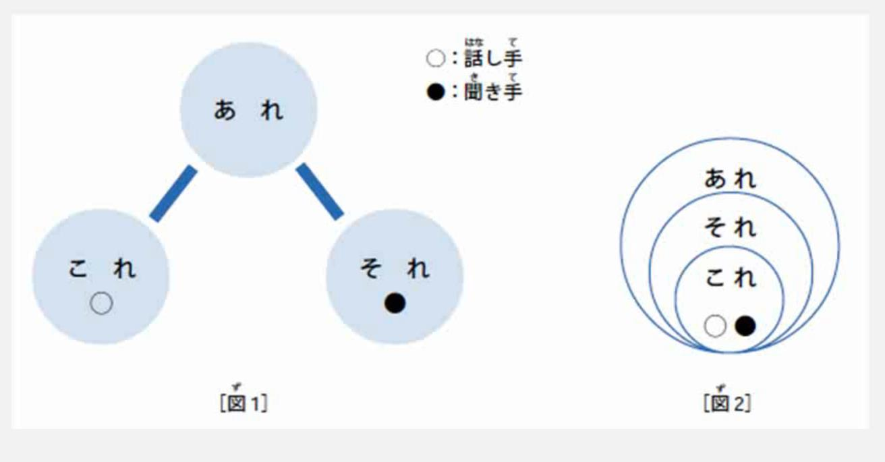

# これは　本です

> こ、そ、あ （对立情况，包含情况）

ど　疑问词

これ,それ,あれ : 这，这个；那，那个

> だれですか/何ですか

不知道是什么人的时候使用`だれ` ---> 谁
不知道是什么事物的时候使用`何` ---> 什么



距离说话人很近（拿在手上，范围，方位[说话人范围之内的]）的都可以使用 `これ`
听话人范围的都可以使用`それ`
离说话人，听话人都有点远的使用`あれ`

> 疑问词

それは　なんですか

それは　本です

特殊疑问句，增加了疑问词：
在不知道词语的地方添加上疑问词.

```
东西 -->  何（なん） （什么）
人 --> 　だれ　誰（谁）
地点-->  哪里
时候 -->  时间
```

句尾仍然使用**ですか**表示疑问

知道答案：
それは　本です
不知道答案：
把对应位置放入相应的疑问词，句尾放入か
それは　何ですか　


あれはひとですか

あの人は誰ですか

> あれは　誰の　傘ですが

の组词

1. 所属关系 ： 私の本
2. 性质内容 ： 布のかばん
3. 产地来源 ： 資生堂（しせいどう）の化粧品（けしょうひん）
4. 准体组词（前边文章已经出现了，这边不需要再次重复）[助词： (用言，体言)]：私の


> この　カメラは　スミスさんのです

区分：

これ　それ　あれ どれ
この～　その～　あの～ どの～

```
この～： の，连体词，要修饰 体言（名词，数词，代词）使用。
これ： 单独使用
```

对立关系的时候：
问答使用：こ，回答使用：そ
问答使用：そ，回答使用：こ

それは何ですか.
これは日本語の本です.

> 方 (かた)

对长辈，工作单位的上司等应该尊敬的对象，或初次见面的人以及交往不多的人，一般使用礼貌语言。

将`この、その、あの　人`变成为`この、その、あの　方`  成为一种礼貌语言。

```
あの　方は　田中さんです
```

# 单词

```
本（ほん） -- 书
かばん -- 包，公文包
ノート -- 笔记本，本子
鉛筆（えんぴつ） -- 铅笔
靴（くつ） -- 鞋子
新聞（しんぶん） -- 报纸
雑誌（ざっし） -- 杂志
辞書（じしょ） -- 词典
テレビ -- 电视机
会社（かいしゃ） -- 公司
家族（かぞく） -- 家人，家属
```

# 数字


# 亲属称谓

规则：
给别人讲家里人的时候辈分或自己家里的事情的时候，都使用  原始的 息子 ， 娘 等等。
剩下情况 都使用 xx さん

和自己的长辈也是使用 xx さん，需要有敬意，使用  xx さん。
长辈，和别人家的亲属，使用  xx さん。
但称呼比自己辈分小的，比如：儿子，女儿，弟弟，妹妹。一般直呼其名。
