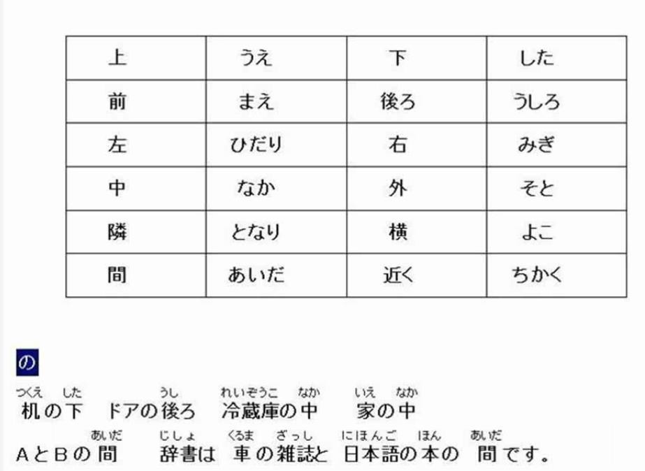

# 部屋（へや）に　机（つくえ）と　椅子（いす）が　ありません

> 存在句

场所  に  物  が  います/あります
翻译：在某个地方有某个东西

あります： 无自由行动意志的，比如植物，非生物等。

に： 存在的地点。
が： 主语，存在的主体。

ありません ： 否定
あります ： 肯定

```
かばんに　ノートと　本が　あります。　 ぺんが　ありません  包里面有书和本，没有笔。
冷蔵庫に　肉と　魚が　あらいます。　野菜が　ぜんぜん　ありません 冰箱里边有肉和鱼，一片蔬菜页也没有。
学校に　食堂が　ありますか。 在学校里有食堂吗？
（学校に）　食堂が　ありあす。　でも　あまり　おいしくないです 有食堂，但是不太好吃。
```

> 机の上に　猫が　います

桌子上有猫。
翻译： xx 有 xx..

います： 有自由行动的 意志，比如人，动物等。

いすの下に　犬が　います。-- 狗狗在椅子下。
あの池に　魚が　いません。-- 水池中没有鱼。


>  （场所 に） 人/物  が   います/あります。

省略（场所 に）
翻译：你有xxx..

```
兄弟がいますか。 -- 你有兄弟么？
彼女が　いませんよ。 -- 我可没有女朋友哦。
日本人の友達が　いますね -- 你有日本人的朋友么。
```
**時間（じかん）用事（ようじ）約束（やくそく）**が　あります。 

公園（こうえん）に　犬（いぬ）が　あります　 -- 公园中有一条小狗

> 売店（ばいてん）は　駅（えき）外（そと）に　あります

は　に　います/あります
物 在 地点

は： 主题， 存在的主体
に： 存在的地点

メガネは　本棚（ほんたな）上（うえ）に　ありません  -- 眼镜不在书架上。

书架上面没有眼镜，前面的句型翻译。

鍵（かぎ）は　かばん　にあります　 -- 钥匙在包里。

あのビルの　隣（となり）　あります --  图书馆在楼的旁边

> 吉田さんは　庭に　います

人/物 は 场所 に　います/あります

人/物 在 地点

は： 主题，存在的主体
に： 存在的地点

森さんは　事務室（じむしつ）に　いますか -- 森先生在办公室吗？

> （人/物 は） 场所 に　います/あります

翻译：在xxx..

社長（しゃちょう）は　どこに　いますか -- 社长在哪里？
会議室（かいぎしつ）にいます -- 在会议室


図書館（としょかん）が　あります -- 有图书馆 （存在的东西）
図書館（としょかん）に　あります -- 在图书馆       

> 疑问词做主语

は->が
错误表达：だれは　部屋に　いますか。
正确表达：だれが　へやに　いますか。或者是：部屋に　だれが　いあますか。
翻译：房间里有谁。

课文句子：
その　箱（はこ）の中（なか）に何（なに）が　ありませか。　
時計（とけい）　眼鏡（めがね）が　あります。
盒子中间有什么？
盒子中有表和眼镜。

箱（はこ）：不仅仅大箱子可以使用，小箱子可以使用，甚至隐形眼镜的箱子也可以使用，饭盒也行。

> と 助词

并列。 "...和..."

每个助词和前边的词是一家人，和后边的词没关系。

书和笔记本
本とノート
本とノート（と）
一般来说，后边一个と被省略

かばんに　本と　ノート（と） が　あります

AとB　の間（あいだ）　between A and B
本屋は　銀行と　コンビニの　間（あいだ）にあります -- 书店在银行和便利店之间
本屋は　銀行と　コンビニの　間（あいだ）です -- 书店在银行和便利店之间（简略的存在句）


部屋に　だれが　いますか。
だれもいません。
房间里有谁？
谁也没有。

> 疑问词 + も + 动词（否定）

可以表达完全否定。
```
庭(にわ)に　何も　ありません。 -- 在院子里边什么也没有。
部屋に　誰も　いません。 -- 谁也不在房间里。
```
```
あそこに　犬（いぬ）　いますね -- 在那边有一条狗，对吧。
ええ、わたしの　犬（いぬ）です。 -- 是的，是我的狗狗。
```

> ね

语气助词
1. 感叹：对吧，是吧。
2. 同感。

当说话人就某事征求听话人的同意时，句尾用助词`ね`，读升调

> 提示

（场所 に） 人/物　が　います/あります。翻译： 在某个地方有某人/某物  --  做介绍的时候
（人/物は） 场所　に　います/あります。 翻译： xx在 xxx -- 以某个物体为中心，找某人/某物的时候

人/动物使用(自由行动意识，拟人情况)：います。
没有自由行动意识：あります。

デパートの隣　に　きんこう　が　あります。 在商城旁边有银行。

> `上`所表示的范围

`上`所表示的范围比汉语的"上"窄，只表示垂直上方的范围.
汉语的"墙上"意思是墙壁的表面，而日语的`壁の上`意思是墙壁上方的天棚，而不是墙壁的表面。墙壁的表面不用`壁（かべ）の上に`而说`壁に`

> ええと

`ええと`是被别人问及某事，思考该如何回答时说的话.

> 兄弟

不仅仅指男性兄弟，兄妹，姐弟，姐妹也称：きょうだい

> 一人暮らし

离开家一个人生活称作`一人暮らし`


# 单词

```
ビル/建物（たてもの） -- 大楼，建筑物
市役所（しやくしょ） -- 市政局
お店（おみせ） -- 商店，小点
本屋（ほんや）　-- 书店
映画館（えいがかん） -- 电影院
警察署（けいさつしょ） -- 警察局
八百屋（やおや） -- 蔬菜店
美術館（びじゅつかん）　-- 美术馆
交番（こうばん） -- 派出所
肉屋（にくや） -- 肉店
体育館（たいいくかん） -- 体育馆
病院（びょういん） -- 医院
（魚屋）さかなや -- 鱼店
博物館（はくぶつかん） -- 博物馆
蕎麦屋（そばや） -- 蕎麦面店
図書館（としょかん） -- 图书馆
銀行（ぎんこう） -- 银行
床屋（とこや） -- 理发店
郵便局（ゆうびんきょく） -- 邮局
薬局（やっきょく） -- 药店
喫茶店（きっさてん） -- 咖啡馆
公園（こうえん） -- 公园
動物園（どうぶつえん） -- 动物园
工場（こうじょう） -- 工厂
遊園地（ゆうえんち） -- 游乐园
劇場（げきじょう） -- 剧场
ホテル -- 宾馆
駐車場（ちゅうしゃじょう） -- 停车场
デパート --  百货超市
スーパー -- 超市
コンビニ -- 便利店
レストラン -- 餐馆，西餐馆
駅（えき） -- 车站
空港（くうこう） -- 机场
学校（がっこう） -- 学校
```
-----

```
部屋（へや） -- 房间，屋子
庭（にわ） -- 院子
家（いえ） -- 家
壁（かべ） -- 墙壁
スイッチ -- 开关
ベッド -- 床
猫（ねこ） -- 猫
犬（いぬ） -- 狗
箱（はこ） -- 盒子，箱子
眼鏡（めがね） -- 眼镜
本棚（ほんだな） -- 书架
ビデオ -- 录像机
ピール -- 啤酒
子供（こども） -- 小孩
兄弟（きょうだい） -- 兄弟姐妹
両親（りょうしん） -- 父母，双亲
妹（いもうと） -- 妹妹
男（おとこ） -- 男
女（おんな） -- 女
生徒（せいと） -- 学生
上（うえ） -- 上面
外（そと） -- 外面
中（なか） -- 里面，内部，中间
下（した） -- 下面
前（まえ） -- 前，前面
後ろ（うしろ） -- 后面
近く（ちかく） -- 附近，近旁
場所（ばしょ） -- 所在地，地方，场所
教室（きょうしつ） -- 教室
会議室（かいぎしつ） -- 会议室
図書室（としょしつ） -- 图书室
公園（こうえん） -- 公园
花屋（はなや） -- 花店
売店（ばいてん） -- 小卖部，售货亭
駅（えき） -- 车站
地下鉄（ちかてつ） -- 地铁
```

# 方位词



上（うえ）
下（した）
前（まえ）
後ろ（後ろ）
隣（となり）
中（なか）
外（そと）

表示具体位置：`名词 ＋ の ＋ 方位名词（うえ）`

汉语说`椅子上`，`桌子下`.而日语说`いすの上`，`机の下`。中的`の`不能省略


# tips

日语的语序是不重要的，只要助词用对了，句子的意思不受影响。


助词和前面的单词是一家的。
日语的动词都是放在一句话的末尾
